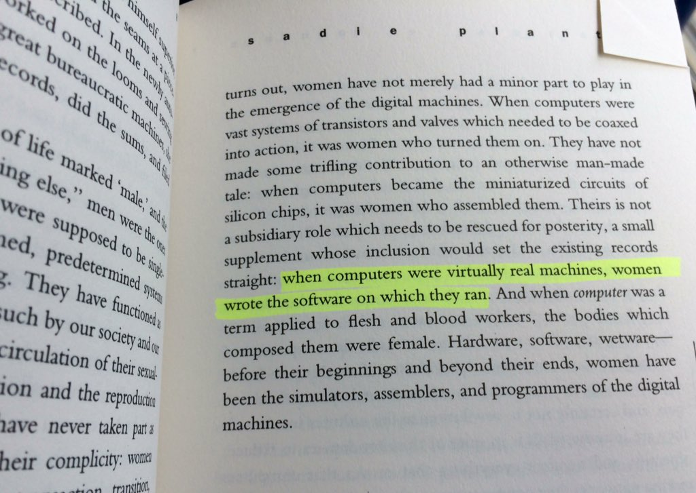
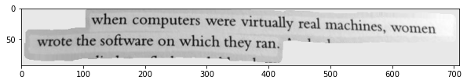
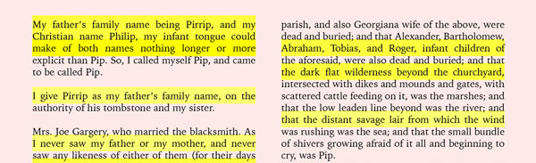
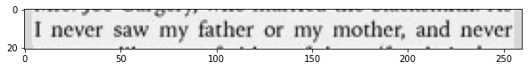
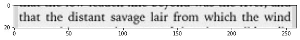
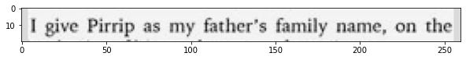
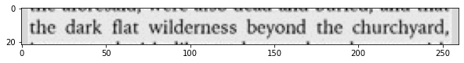
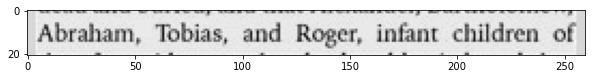
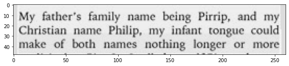

# Highlighted-Text extraction API

<br/>
The current repository contains the libraries developed for the Kimo.ai Highlighted Text extraction and OCR functionality.
<br/>

# The current version supports:
```
1) Detection of highlighted regions within a printed document from an image file
2) Wrap transformation of the detected regions
3) OCR of the detected highlighted text
```
<br/>

# Requirements
```
Numpy
OpenCV
Matplotlib
Scipy
Pytesseract

The present libraries are being developed in Python 3.7
```

# Highlighted text OCR running example


### Example A

<table align='center'>
<td></td>
</table>

```
import time, cv2
import imgProc
from pipeline import highlightedTextAcquisition as hta

image_path = 'images/test5.jpg'
textual_data = hta.run(cv2.imread(image_path), showMaps=True)
```
<table align='center'>
<td></td>
</table>

```
>>> Executed time: 0.351 sec
```

```
for d in textual_data:
    print(d)

>>> when computers were virtually real machines, women
wrote the software on which they ran. * * *
```

### Example B

<table align='center'>
<td></td>
</table>

```
import time, cv2
import imgProc
from pipeline import highlightedTextAcquisition as hta

image_path = 'images/test3.jpg'
textual_data = hta.run(cv2.imread(image_path), showMaps=True)
```
<table align='center'>
<tr>
<td></td>
</tr>
<tr>
<td></td>
</tr>
<tr>
<td></td>
</tr>
<tr>
<td></td>
</tr>
<tr>
<td></td>
</tr>
<tr>
<td></td>
</tr>
</table>

```
>>> Executed time: 1.65 sec
```

```
for d in textual_data:
    print(d)

>>> I never saw my father or my mother, and never.

that the distant savage lair from which the wind

| give Pirrip as my father’s family name, on the

‘the dark flat wilderness beyond the churchyard,

Abraham, Tobias, and Roger, infant children of

My father’s family name being Pirrip, and my
Christian name Philip, my infant tongue could
make of both names nothing longer or more

```